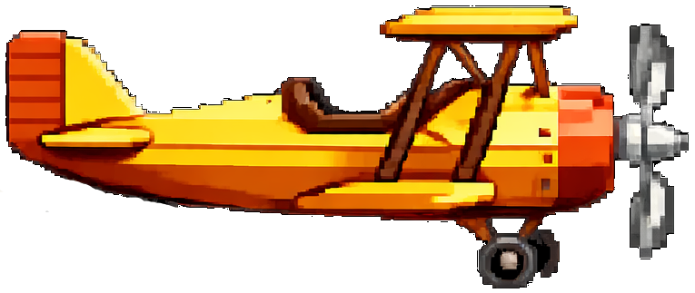
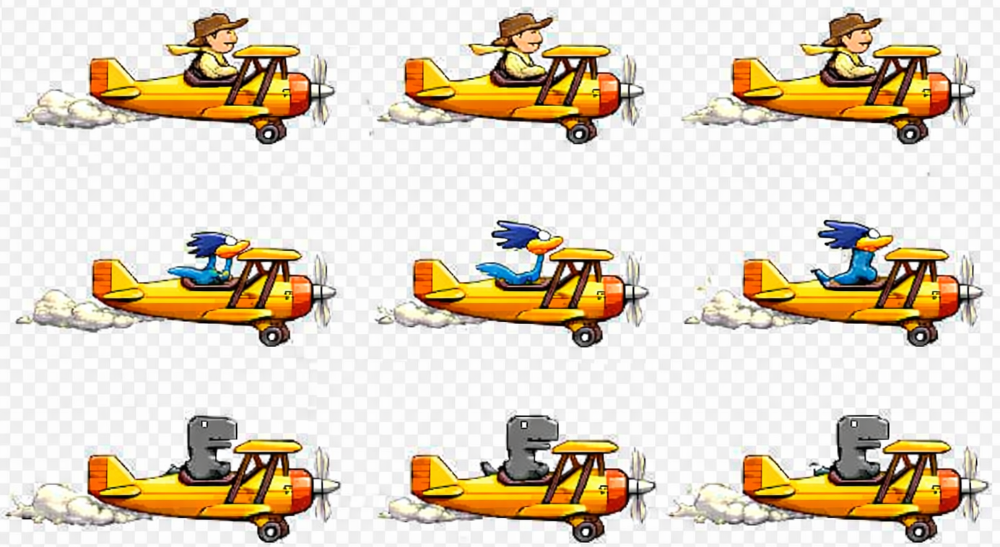

# Dino Game in Python Processing

Deze game is een variant op de Chrome Dino game, met meerdere speelbare karakters, verschillende obstakels en level-progressie.

## Speloverzicht

- De speler kiest op het startscherm een karakter: dino, cowboy of roadrunner.
- De speler start met `SPACE` (of `A`).
- Het karakter beweegt horizontaal niet zelf; obstakels bewegen van rechts naar links.
- Bij een botsing eindigt het spel en verschijnt een game-over scherm.

## Besturing

- `Pijl omhoog`: springen.
- `Pijl omlaag`: bukken; in de lucht activeert dit snelle val.
- `P`: pauze toggle.
- `D`: debug mode toggle (rode hitbox-visualisatie).
- `I`: info/instructiescherm toggle.
- `Q` of `ESC`: afsluiten.

## Gameplay en score

- Elk obstakel heeft eigen puntenwaarde.
- Voorbeelden:
  - Lage cactus: 1 punt.
  - Hoge cactus: 2 punten.
  - Torencactus: 4 punten.
  - Vogel (laag, succesvol gedukt): 3 punten.
  - Slang (uitklappend dichtbij): 5 punten.
- Elke 10 punten stijgt het level en neemt de snelheid toe met factor 1.1.
- Bij level-up knipperen score en level-indicator kort.

## Obstakels en speciale acties

- De slang klapt uit wanneer hij dicht bij de speler komt.
- De lage vogel vereist bukken om punten te krijgen.
- High jump activeert wanneer de speler eerst bukt en binnen 0,5 seconde springt.
- Torencactus verschijnt vanaf level 3 en vereist doorgaans high jump.
- Bij een naderende torencactus verschijnt kort:
  - `Prepare for high jump: duck first then quickly jump.`

## Level 5: vliegtuig en flight mode

- In level 5 verschijnt een vliegtuig.
- De speler springt bovenop het vliegtuig om flight mode te starten.
- Na activatie speelt de game in een extra vliegsegment:
  - De speler bestuurt het vliegtuig in de linkerhelft van het scherm.
  - Beweging werkt met pijltjes links/rechts/omhoog/omlaag.
  - Er verschijnt een extra level met Flappy Bird-achtige pijpen aan boven- en onderkant.

## Levelprogressie tot level 10

- De game heeft 10 levels.
- In elk nieuw level verschijnt minstens één nieuw vijandtype of een nieuwe variant/aanvalsvorm.
- Moeilijkheid neemt per level toe via snelheid, spawnmix en patrooncomplexiteit.

## Assets
Sprite vliegtuig

- Speler- en obstakelassets staan in `assets/`.
- Belangrijke sprites:
  - `assets/dino-transparant.png`
  - `assets/cowboy-transparant.png`
  - `assets/roadrunner-transparant.png`
  - `assets/airplane-transparant.png`
  - `assets/cactus-transparant.png`
  - `assets/bird-transparant.png`
  - `assets/snake-transparant.png`
